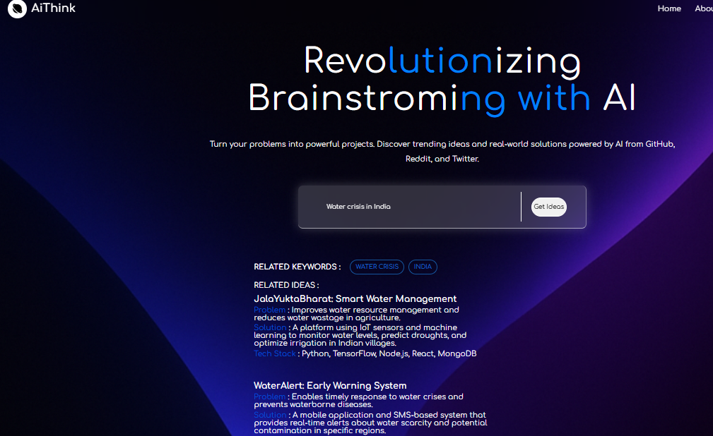

# 🧠 AiThink | An Idea Aggregator

A sleek, full-stack web app that brings together top tech ideas from GitHub, X (formerly Twitter), Reddit, and more—making it easier for developers and enthusiasts to stay inspired and discover what's trending in the world of tech and AI.



##  Features

-  **Unified Search** – Enter a keyword and get curated results from:
  - GitHub Repositories
  - Reddit Posts
  - X Posts
  - Unique Idea Suggestions
- **Idea-First View** – Clean display of the most relevant *idea* for your query
- **Authentication** – Login to access full features
- **Dark Mode** – Comfortable browsing experience
- **Demo Page** – Visual walkthrough of app functionality

## Tech Stack

- **Frontend**: React, Material UI, Vite
- **Backend**: Node.js, Express
- **Web Scraping/API**: SerpAPI, GitHub API, Reddit API, X (Twitter) scraping
- **Authentication**: bcrypt + JWT-based 
- **Deployment**: [Render](https://render.com) 

## 📸 Demo

> Visit the [Demo Page](https://your-site.com/demo) to see screenshots and a walkthrough.

## ✨ Getting Started

### 1. Clone the repo

```bash
git clone https://github.com/vivek-patel-here/AiThink-idea-aggregator
cd AiThink-idea-aggregator

**Backend setup**
cd backend
npm install
# Add your .env file with API keys and config
node app.js ( you can use nodemon for development purpose)

**Environment variable setup**
# .env
DB_URL="..." //mongodb_uri
JWT_SECRET="..."
COOKIE_SECRET="..."
GEMINI_API_KEY="<Your gemini api key here>"
GITHUB_TOKEN="<Your Github access token>"
SERP_API_KEY="<Your Serp_api key >"


**FrontEnd setup**
cd ../client
npm install 
npm run dev

<br> <br>

## Essential setting to bypass browser restriction

### For Google Chrome

- go to chrome://settings/cookies or Settings > Privacy and security > Third-party cookies.
- Ensure that "Block third-party cookies" or "Block all cookies" is NOT selected.
- You might need to select "Allow third-party cookies" or, for more fine-grained control, "Block third-party cookies in Incognito" .
- Then add '[*.]onrender.com' as an allowed site under "Sites that can always use cookies."

